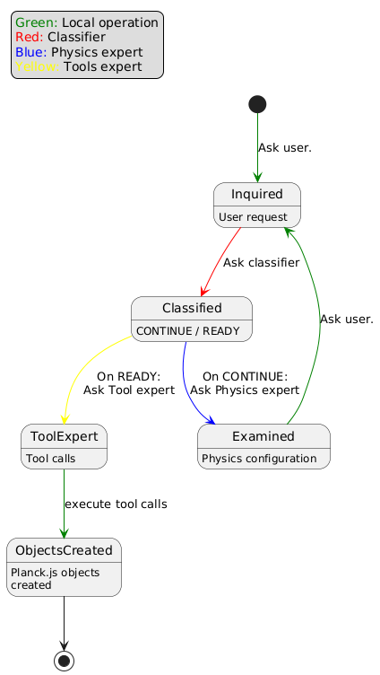

# Physics Expert
Implementation of a Task-Oriented Dialog system with ChatGPT.

It combines three experts: 
1. a Physics expert that can help a user of a 2D Physics Engine to create a configuration
of objects to simulate a Physics problem.
2. a Tools expert that can transform the text description created by the Physics expert into `bodies` in the
Planck.js 2D physics engine, by calling "tools".
3. a Classifier that determines if the user should continue to interact with the Physics expert of if he wants
the Tools expert to be invoked.

## How to run

In order for the OpenAI API to be instantiated, one needs a `.env` file with the OpenAI key, like this:

```
OPENAI_API_KEY=xxxxxxxxxxxxxxxxxxxxxxxxxx
```

## Dialog State
In contrast with the kind of dialog implemented in a [previous experiment](https://github.com/dsouflis/cypher-expert),
there are now two user intents. The system should firstly determine what the intent of the user is, then proceed
accordingly. The dialog follows the statemachine in the image.



For purposes of demonstration, only two "tools" are defined: one to create rectangular shapes, and one to create
circular shapes.

## Countering the variability of responses
My first approach for decoding the configuration produced by ChatGPT was to try and parse the text. But this
proved an elusive target, as every run produced text in slightly or hugely different syntax and format.

*I had asked for a rotating marble in this interaction:*
```
- Ground:
  - Type: Static
  - Positions: (x = 0, y = 0)

- Marble:
  - Type: Circle
  - Mass: 1 kg
  - Radius: 0.1 m
  - Initial Position: (x = 0, y = 5)
  - Initial Velocity: (vx = 0.5 m/s, vy = -3 m/s)
  - Initial Angular Velocity: 2 radians/sec
```

Sometimes it used Markdown subsections, or bold annotations. Then I specifically requested for the 
configuration to be in plaintext. This, at least, removed all formatting other than bullets. But the 
responses were still unpredictable.

*That time, I had asked for three marbles*
```
Objects:
1. Ground:
   - Type: Static
   - Position: (x=0, y=0)

2. Marble 1:
   - Type: Circle
   - Position: (x=0, y=2)
   - Mass: 0.05 kg
   - Is Free: Yes

3. Marble 2:
   - Type: Circle
   - Position: (x=0, y=0)
   - Mass: 0.05 kg
   - Is Free: No
```

*The next time I got:*

```
Ground:
  Type: Static
  Position: (0, 0)
  Width: 10
  Height: 1

Marble1:
  Type: Circle
  Position: (0, 1)  # Above the ground
  Radius: 0.2
  Mass: 0.5
  State: Immovable

Marble2:
  Type: Circle
  Position: (0, 3)  # Positioned directly above the first marble
  Radius: 0.2
  Mass: 0.5
  State: Free
```

*And the one after that I got*
```
Ground: { type: "static", position: (0, 0) }

First Marble: {
type: "circle",
mass: 1,
position: (0, 1),
static: true
}

Second Marble: {
type: "circle",
mass: 1,
position: (0, 3),
static: false
}
```

By that time, I had realized that there was only one thing that could be trusted to parse a varying response
by ChatGPT and create neat ontologies. And that was ChatGPT itself. The last examples were from when I was 
debugging the third expert in this system, the Tools expert. The Tools expert also goes the extra mile of
supplementing information that is missing. Note that, in one of the responses above, no radius is specified
for the circles! And yet the Tools expert managed to create the following two Planck.js shapes:

```
CircleShape {
  style: {},
  appData: {},
  m_type: 'circle',
  m_p: Vec2 { x: 0, y: 0 },
  m_radius: 0.5
}
CircleShape {
  style: {},
  appData: {},
  m_type: 'circle',
  m_p: Vec2 { x: 0, y: 0 },
  m_radius: 0.5
}
```

The final "JSON-oid" response, was also parsed correctly. The resulting tool_call arguments, and the 
resulting shapes, body definitions, and mass definitions, for the ground and the two circles were:

```
create_rectangle {
  name: 'Ground',
  immovable: true,
  initial_position_x: 0,
  initial_position_y: 0,
  width: 100,
  height: 1
}
shape= PolygonShape {
  style: {},
  appData: {},
  m_type: 'polygon',
  m_radius: 0.01,
  m_centroid: Vec2 { x: 0, y: 0 },
  m_vertices: [
    Vec2 { x: 50, y: -0.5 },
    Vec2 { x: 50, y: 0.5 },
    Vec2 { x: -50, y: 0.5 },
    Vec2 { x: -50, y: -0.5 }
  ],
  m_normals: [
    Vec2 { x: 1, y: -0 },
    Vec2 { x: 0, y: 1 },
    Vec2 { x: -1, y: -0 },
    Vec2 { x: 0, y: -1 }
  ],
  m_count: 4
}
body= { type: 'dynamic', position: Vec2 { x: 0, y: 0 } }
massData= { mass: undefined, center: Vec2 { x: 0, y: 0 }, I: 0 }
create_circle {
  name: 'First Marble',
  mass: 1,
  radius: 0.5,
  initial_position_x: 0,
  initial_position_y: 1,
  immovable: true
}
shape= CircleShape {
  style: {},
  appData: {},
  m_type: 'circle',
  m_p: Vec2 { x: 0, y: 0 },
  m_radius: 0.5
}
body= { type: 'dynamic', position: Vec2 { x: 0, y: 1 } }
massData= { mass: 1, center: Vec2 { x: 0, y: 0 }, I: 0 }
create_circle {
  name: 'Second Marble',
  mass: 1,
  radius: 0.5,
  initial_position_x: 0,
  initial_position_y: 3,
  immovable: false
}
shape= CircleShape {
  style: {},
  appData: {},
  m_type: 'circle',
  m_p: Vec2 { x: 0, y: 0 },
  m_radius: 0.5
}
body= { type: 'dynamic', position: Vec2 { x: 0, y: 3 } }
massData= { mass: 1, center: Vec2 { x: 0, y: 0 }, I: 0 }
```

The details, of course, are immaterial and are just a reflection of how Planck.js objects are created
(and they might be wrong, for all I know, as I'm not an active user of it!). But I wanted this demonstration
to result in something tangible. 

I didn't opt for JSON formatted output, because I believe that it could not handle variable schemas. But
maybe I'm wrong. But tool-calling already had the proven ability to deal with different kinds of calls taking 
different sets of parameters.

## Conclusion
This implementation proves that dialog systems that can deal with multiple user intents can be built on top
of general-purpose (non-fine-tuned) LLMs, and adapt to ontologies that are known to the LLM. The user can
interact with the LLM at the level of natural language, and the distillation of the mutually-agreed
information into machine-readable artifacts can also be done by the LLM, either through tool-calling or
through formatted output.
